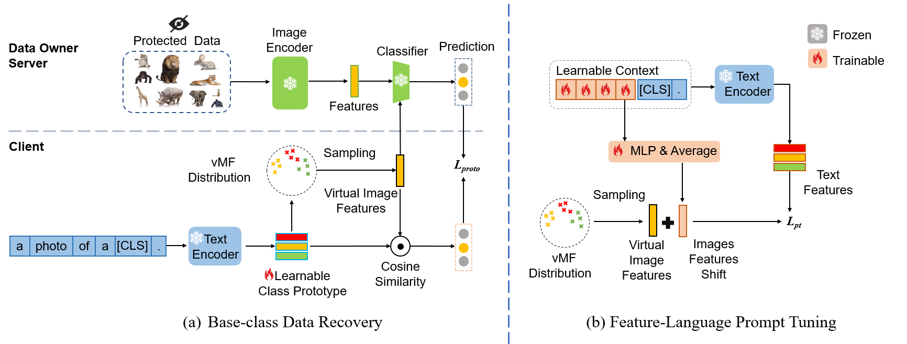

[Data-Free Zero-Shot Learning](https://ojs.aaai.org/index.php/AAAI/article/view/28316), AAAI,2024
## Overview

## Prerequisites
+ Python==3.8
+ ftfy==6.1.1
+ easydict==1.10
+ easydl==2.2.0
+ numpy==1.24.3
+ optuna==3.2.0
+ pandas==1.5.3
+ Pillow==9.3.0
+ PyYAML==6.0
+ regex==2023.5.5
+ scikit_learn==1.2.2
+ scipy==1.10.1
+ torch==1.11.0
+ torchvision==0.12.0
+ tqdm==4.65.0

## Installation
The model is built in PyTorch 1.11 and tested on Ubuntu 16.04 environment (Python3.8, CUDA 11.7, cuDNN 8.2.0).

For installing, follow these intructions
```
conda create -n DFZSL python=3.8
conda activate DFZSL
conda install pytorch==1.11.0 torchvision==0.12.0 torchaudio==0.11.0 cudatoolkit=11.3 -c pytorch
```


### Datasets of GZSL

Download CUB, AWA, FLO and SUN features from the drive link shared below.
```
link: https://drive.google.com/drive/folders/16Xk1eFSWjQTtuQivTogMmvL3P6F_084u?usp=sharing
```
Extract res101.mat and att_splits.mat from each dataset downloaded,  put them in DFZSL/datasets folder.  
The res101.mat contains the res101 image features, and the att_splits.mat contains the class split and the corresponding attribute annotations for each class.

Run DFZSL/splits/extract_clip_feature.py to replace the res101 image features with ViT-B16 features, 
and also replace the attribute annotations with CLIP text features of the corresponding class.  
res101.mat--->ViTB16.mat  
att_splits.mat--->clip_splits.mat

### Datasets of base-to-new
You can download the 11 datasets and the corresponding divisions used for the Base-to-New Generalization experiment at the link provided by the CoOp authors.
```
link:https://github.com/KaiyangZhou/CoOp/blob/main/DATASETS.md
```
Similarly, run DFZSL/splits/split_{dataset_name}.py to generate ViTB16.mat and clip_splits.mat


### Experiments

1. Training a classifier for a black-box server
```
cd DFZSL/vdm 
python  feature_train_seen_teacher.py  --config configs/AWA2.yaml
```
2. Recover the virtual image features from the black box server.
```
python  get_seen_virtual_domain.py  --config configs/AWA2.yaml
```
3. Feature-Language Prompt Tuning (FLPT) to further align the virtual image features and textual features.
```
cd DFZSL/pt
python  feature_train_prompt.py  --config  configs/GZSL/AWA2.yaml
```
4. Using existing generation-based methods, traine the generator to generate features for new classes and train fully supervised classifiers.
```
cd DFZSL/tfvaegan
python  scripts/run_AWA2_tfvaegan.py
```

## Citation:

If you find this useful, please cite our work as follows:
```
@inproceedings{tang2024data,
  title={Data-Free Generalized Zero-Shot Learning},
  author={Tang, Bowen and Zhang, Jing and Yan, Long and Yu, Qian and Sheng, Lu and Xu, Dong},
  booktitle={Proceedings of the AAAI Conference on Artificial Intelligence},
  volume={38},
  number={6},
  pages={5108--5117},
  year={2024}
}
```


